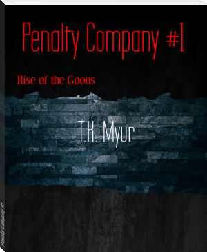
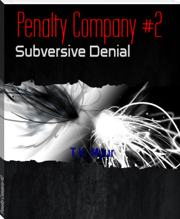
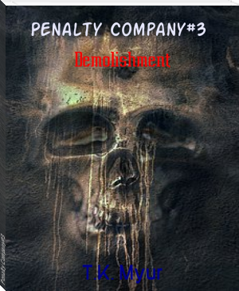
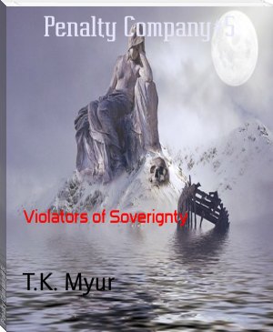

<!DOCTYPE html>
<html lang="en">
  <head>
    <meta charset="UTF-8" />
    <meta name="viewport" content="width=device-width, initial-scale=1.0" />
    <title>T.K. Myur's Books</title>

    <!-- Stylesheets -->
    <link
      rel="stylesheet"
      href="https://cdnjs.cloudflare.com/ajax/libs/font-awesome/6.4.2/css/all.min.css"
      integrity="sha512-z3gLpd7yknf1YoNbCzqRKc4qyor8gaKU1qmn+CShxbuBusANI9QpRohGBreCFkKxLhei6S9CQXFEbbKuqLg0DA=="
      crossorigin="anonymous"
      referrerpolicy="no-referrer" />
    <link rel="preconnect" href="https://fonts.googleapis.com" />
    <link rel="preconnect" href="https://fonts.gstatic.com" crossorigin />
    <link
      href="https://fonts.googleapis.com/css2?family=Nanum+Gothic+Coding&display=swap"
      rel="stylesheet" />
    <link
      href="https://fonts.googleapis.com/css2?family=Handjet&display=swap"
      rel="stylesheet" />
    <link
      href="https://fonts.googleapis.com/css2?family=Nanum+Gothic&display=swap"
      rel="stylesheet" />
    <link rel="stylesheet" href="style.css" />

    <!-- Scripts -->
    
  </head>

  <body>
    <header>
      <h1>Welcome to T.K. Myur's Books</h1>
      <nav>
        <ul>
          <li><a href="#home">Home</a></li>
          <li><a href="#about">About</a></li>
          <li><a href="#contact">Contact</a></li>
        </ul>
      </nav>
    </header>

    <main>
      <section id="home">
        <h1>Explore T.K. Myur's books</h1>
        <!-- Book 1 (Penalty Company #1) -->
        <section class="book-section">
          <h2>
            <a
              target="_blank"
              href="https://www.bookrix.com/_ebook-t-k-myur-penalty-company-1/">Penalty
              Company #1</a>
          </h2>
          

            
            

              

                Michael Korvin was born to be an assassin. It's all he's ever
                known, but is it all he really is? Witness the beginning of the
                rise...
              

            

          

        </section>
        <!-- Book 2 (Penalty Company #2) -->
        <section class="book-section">
          <h2>
            <a
              target="_blank"
              href="https://www.bookrix.com/_ebook-t-k-myur-penalty-company-2/">Penalty
              Company #2</a>
          </h2>
          

            
            

              

                The war for Daax begins, and a mysterious new enemy emerges from
                the shadows. Can Michael find the courage to stand against true
                evil and learn the truth about his past?
              

            

          

        </section>
        <!-- Book 3 (Penalty Company #3) -->
        <section class="book-section">
          <h2>
            <a
              target="_blank"
              href="https://www.bookrix.com/_ebook-t-k-myur-penalty-company-3/">Penalty
              Company #3</a>
          </h2>
          

            
            

              

                The exciting conclusion to the War of Daax. Will Waarp finally
                get his reckoning? Can anyone stop ECHO? The saga continues in
                explosive fashion! One more battle...One more ride.
              

            

          

        </section>
        <!-- Book 4 (Penalty Company #4) -->
        <section class="book-section">
          <h2>
            <a
              target="_blank"
              href="https://www.bookrix.com/_ebook-t-k-myur-penalty-company-4/">Penalty
              Company #4</a>
          </h2>
          

            
            

              

                A meeting of the New and Old World orders at the center of the
                world. New Revelations abound as Michael and Waarp come face to
                face with their destinies.
              

            

          

        </section>
        <!-- Book 5 (Penalty Company #5) -->
        <section class="book-section">
          <h2>
            <a
              target="_blank"
              href="https://www.bookrix.com/_ebook-t-k-myur-penalty-company-5/">Penalty
              Company #5</a>
          </h2>
          

            
            

              

                A declaration of war was made by Shuga and it's allies. Now the
                kingdoms band together and the new generation steps forward to
                confront the storm of violence. For Vengeance. For Honor. For
                real.
              

            

          

        </section>
      </section>
    </main>
    <footer>© 2023 JMC Publishing. All rights reserved.</footer>
  </body>
</html>
# JMC-Publishing
